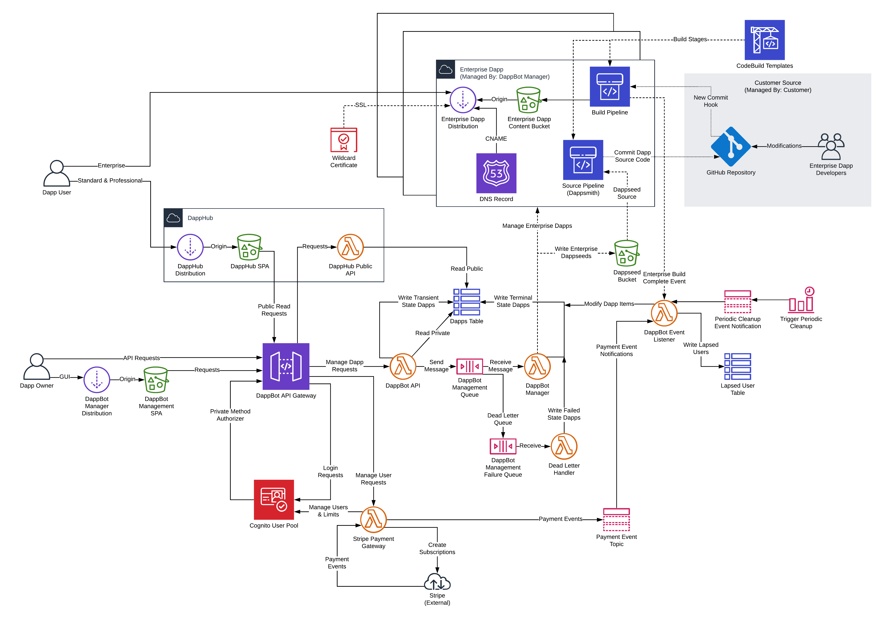

# DappBot Documents

This directory contains documents related to [DappBot](https://dapp.bot/)

* [API Spec](api.md)
* [Payment Gateway Spec](paymentgateway.md)

## Architecture

[Diagram File](architecture-diagram.png)

## Repository Overview

There are a number of interconnected repositories required within this product.

- Infrastructure
  - [terraform-aws-dappbot](https://github.com/Eximchain/terraform-aws-dappbot): Repo which creates all infrastructure in the above diagram except for the contents of "Stripe Payment Gateway".
  - [terraform-aws-payment-gateway-stripe](https://github.com/Eximchain/terraform-aws-payment-gateway-stripe): Spins up the infrastructure for the contents of "Stripe Payment Gateway".
  - [dappbot-domain-infrastructure](https://github.com/Eximchain/dappbot-domain-infrastructure): Minimal repo which creates and validates the `dapp.bot` domain in our account.
- Lambda Functions
  - [dappbot-api-lambda](https://github.com/Eximchain/dappbot-api-lambda): Connects to the API Gateway, responsible for handling client requests, writing transient dapp state to DynamoDB, and then sending messages to the SQS Manager queue.
  - [dappbot-manager-lambda](https://github.com/Eximchain/dappbot-manager-lambda): Pulls messages from the SQS Manager queue and interacts with other AWS services to perform dapp operations and place them in terminal states.
  - [dappbot-event-listener-lambda](https://github.com/Eximchain/dappbot-event-listener-lambda): Listens and responds to various events; currently handles the end of CodePipelines and periodic cleanups.
  - [payment-gateway-stripe-lambda](https://github.com/Eximchain/payment-gateway-stripe-lambda): Connects to API Gateway so the dappbot users can create/update subscriptions on our Stripe account.  Also responds to their webhooks so we know when payments succeed or fail.
- Front Ends
  - [dappbot-management-spa](https://github.com/Eximchain/dappbot-management-spa): `create-react-app` client for [dapp.bot](dapp.bot).  Shows you the marketing page when logged out, includes the full dapp management interface once you log in.  This is where payments happen.
  - [dapphub-spa](https://github.com/Eximchain/dapphub-spa): Highly customized `dappsmith` output which, rather than being customized for one contract, pulls from the `dappbot` public API to render interfaces & load history for arbitrary contrats.  Will eventually live at `hubb.dapp.bot`.
  - [dappbot-api-client](https://github.com/Eximchain/dappbot-api-client): NPM package for interacting with the API.  Any client is just another interface!