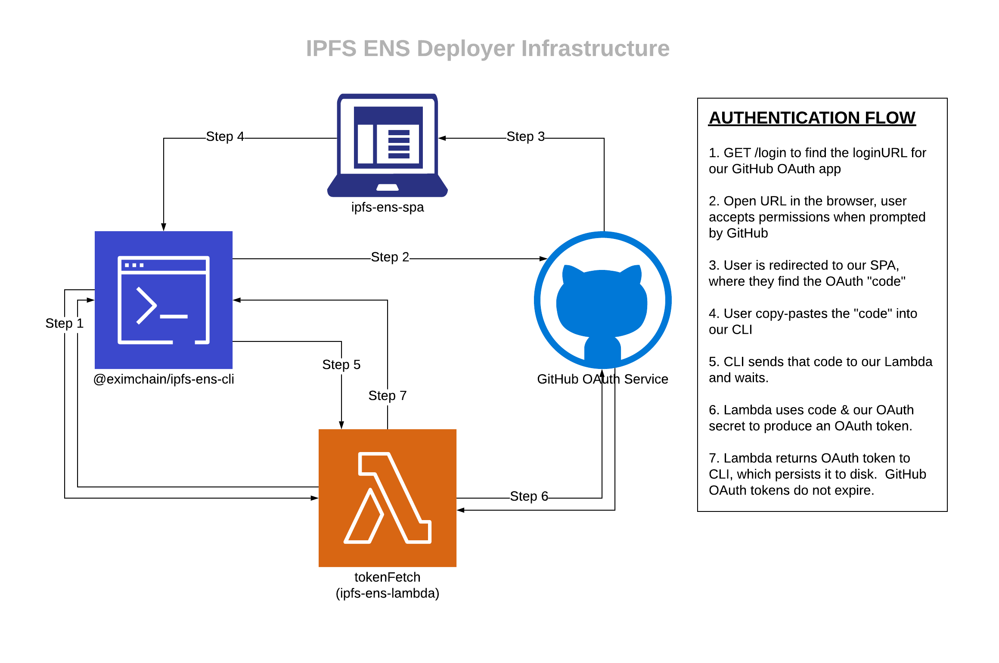
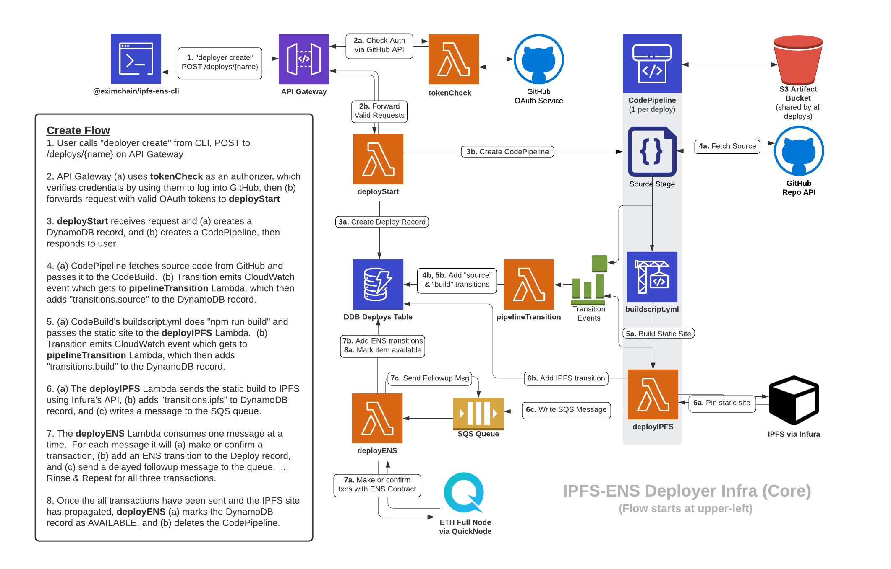
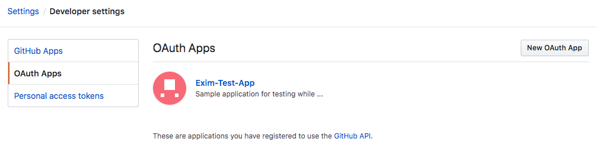

# IPFS-ENS Documents

This directory contains documents related to the IPFS-ENS Deployer.

## Repository Overview

This product is built on a few interconnected repositories:

- [terraform-ipfs-ens](https://github.com/Eximchain/terraform-ipfs-ens): Terraform to create infrastructure
- [ipfs-ens-types](https://github.com/Eximchain/ipfs-ens-types): Shared types package
- [ipfs-ens-api-client](https://github.com/Eximchain/ipfs-ens-api-client): Easy node.js client for calling our IPFS-ENS API
- [ipfs-ens-lambda](https://github.com/Eximchain/ipfs-ens-lambda): Source for all of the Lambda functions
- [ipfs-ens-cli](https://github.com/Eximchain/ipfs-ens-cli): CLI for interacting with IPFS-ENS API, privately published on npm
- [ipfs-ens-spa](https://github.com/Eximchain/ipfs-ens-spa): create-react-app used for OAuth redirects during login

Each repository has its own README documenting its specific details, so that information is not duplicated here.  This page documents the overall system architecture and details related to administering it as a whole.

## Architecture

First, here is the diagram describing the flow for getting authentication from GitHub:

And now the remainder of the infra, used for actually building and deploying sites to IPFS:

## Development

### GitHub OAuth App

This product requires a GitHub OAuth App to work correctly.  Eximchain has one for use in production, but you can also create a personal one for testing.  Go to your GitHub Settings page and find the "Developer Settings" tab.  Within that tab, it will first show you "GitHub Apps" -- this isn't what we want.  We want "OAuth Apps", as seen in the screenshot below:

https://github.com/settings/developers

When you create a new app, it will ask for a name, homepage, and redirect URL.  This product mostly lives in the command line; the SPA's only purpose is to handle this redirect.  Put in the SPA's domain (e.g. `https://ipfs-johno.eximchain-dev.com`) for both of those fields.

Once you have finished creating the app, you will be able to see its Client ID and Client Secret.  Both of these values should be plugged into the Terraform variables.

### Database Migration

If you are creating a new version of this infrastructure which reuses a host domain, you should migrate the contents of the old database to the new infra.  Our name checks just look into the DynamoDB, so if you don't migrate the old records, you may get collision errors when attempting to set the ENS domain.  We haven't had to do this before, but AWS has articles specifically about [Exporting & Importing Data from DynamoDB](https://docs.aws.amazon.com/amazondynamodb/latest/developerguide/DynamoDBPipeline.html) -- just remember to transfer the data to the new table and we should be good to go.